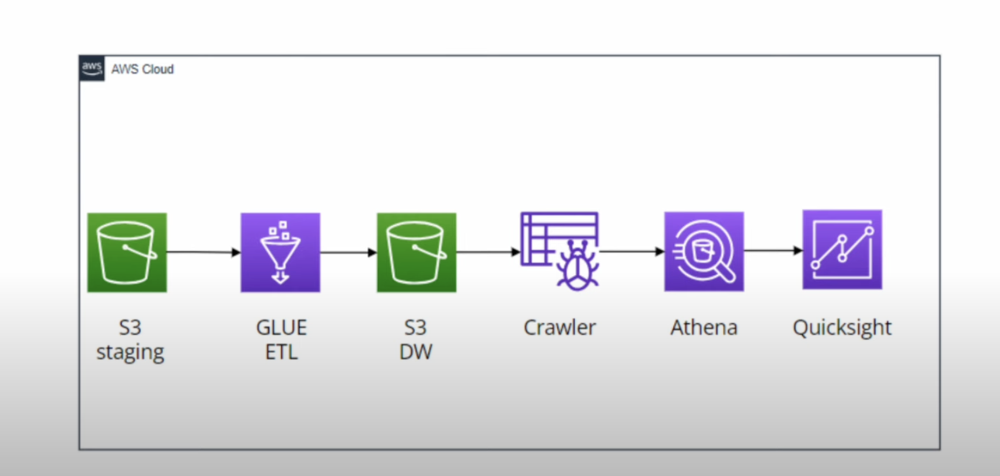
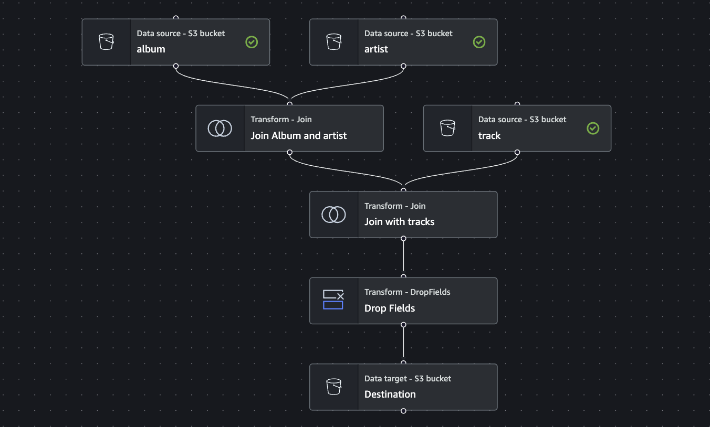

# Spotify-AWS-DataEngineering-Project

This repository contains an AWS project for processing and analyzing Spotify data using various AWS services. The project workflow involves using AWS S3, Glue, Athena, and QuickSight to create a data pipeline, catalog the data, run queries, and visualize the results.

## Project Architecture

## Data

The dataset used in this project consists of three CSV files obtained from Kaggle:
- artist.csv
- album.csv
- track.csv

These files are initially uploaded to the staging folder in an S3 bucket.

## Workflow

1. *S3 Setup:*
   - Create an S3 bucket with two folders: staging and datawarehouse.
   - Upload the CSV files to the staging folder.

2. *AWS Glue ETL:*
   - Use AWS Glue to create a data pipeline that transforms the data and moves it from the staging folder to the datawarehouse folder.

3. *Glue Crawler:*
   - Create a Glue Crawler to catalog the data and create a database.
   - Go to AWS Glue and create a database.
   - Configure the Glue Crawler to source data from the datawarehouse folder and set the destination to the created database.
   - Run the crawler to generate tables in the database.

4. *Athena:*
   - Use AWS Athena to write SQL queries on the database created by the Glue Crawler.
   - Create a new S3 bucket to store the results of Athena queries.

5. *QuickSight:*
   - Use AWS QuickSight to create visualizations based on the Athena queries.
   - Configure QuickSight to access the database and create interactive dashboards.

## Repository Structure

- data/: Contains the CSV files used in the project.
- scripts/: Contains Python scripts and SQL queries used in the project.
  - spotify_etl_script.py: Script for AWS Glue ETL job.
  - spotify_athena_queries.sql: SQL queries for Athena.
- schema/: Contain the schema
  - table-schema.json: contain the schema of the table
- images/: Contains images for the architecture and data pipeline diagrams.
- README.md: Documentation for the project.

## How to Run

1. *Setup S3 Bucket:*
   - Create an S3 bucket with staging and datawarehouse folders.
   - Upload the CSV files to the staging folder.

2. *Run AWS Glue ETL:*
   - Create and run an AWS Glue ETL job using the etl_script.py.

3. *Run Glue Crawler:*
   - Configure and run the Glue Crawler.

4. *Query Data with Athena:*
   - Write and execute SQL queries in Athena using spotify_athena_query.sql.
   - Save the query results to the specified S3 bucket.

5. *Create QuickSight Visualizations:*
   - Configure QuickSight and create dashboards

## Prerequisites

- AWS account with access to S3, Glue, Athena, and QuickSight.
- Python 3.x installed locally.
